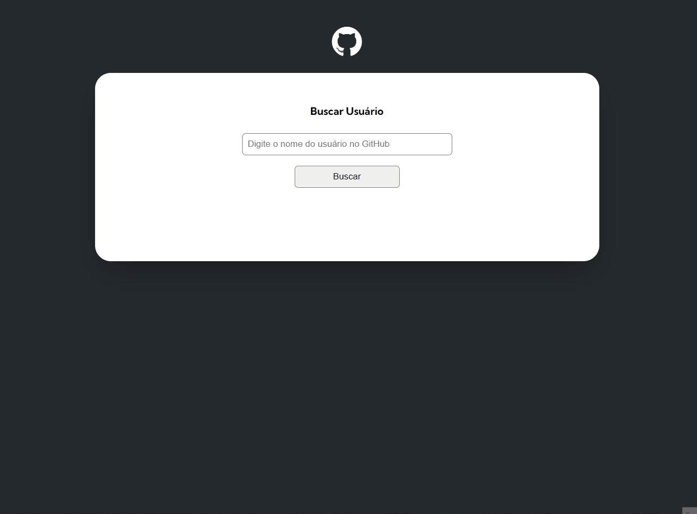

# Projeto GitHub API - buscando usuários com fetch

Projeto que consome uma API do GitHub para buscar e exibir na tela as informações de um usuário.

## Índice

- [Visão geral](#visão-geral)
  - [Desafio](#desafio)
  - [Screenshot](#screenshot)
  - [Links](#links)
- [Meu processo](#meu-processo)
  - [Como usar](#como-usar)
  - [Tecnologias utilizadas](#tecnologias-utilizadas)
- [Autor](#autor)
- [Agradecimentos](#agradecimentos)

## Visão geral

### Desafio

- criar um projeto que busca as informações de um usuário do GitHub
- informações do usuário que devem ser exibidas na tela:
    - nome do usuário
    - foto de perfil
    - bio
    - número de contas que o usuário segue
    - número de seguidores que o usuário possui
    - link de 10 repositórios
    - 10 últimos eventos 
- Os eventos que serão apresentados devem ser de dois tipos: CreateEvent e PushEvent apenas, e para cada atividade é necessário mostrar o nome do repositório e a mensagem do evento
- cada repositório que for mostrado deve conter as seguintes informações:
    - Quantidade de forks do repositório
    - Quantidade de estrelas do repositório
    - Quantidade de watchers do repositório
    - Mostrar a linguagem de programação do repositório

### Screenshot

#### Desktop

#### Mobile

### Links

- URL da página: [GitHub API](https://alexjr53.github.io/Projeto-mundo-real-com-fetch-e-GitHub./) 

## Meu processo

### Tecnologias utilizadas

- HTML
- CSS
- Javascript

## Autor
Alexsandro rosa junior

- GitHub - [Alexjr53](https://github.com/Alexjr53)

## Agradecimentos
Agradecimentos a equipe [Dev em Dobro](https://www.instagram.com/devemdobro/) que está me passando o conhecimento e conceitos necessários para poder realizar esses desafios.
